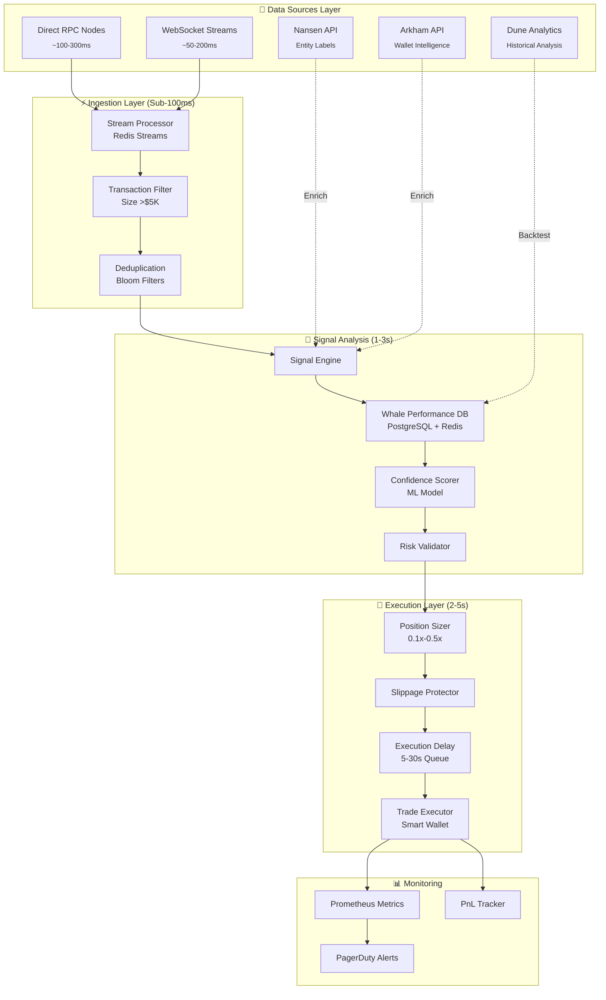
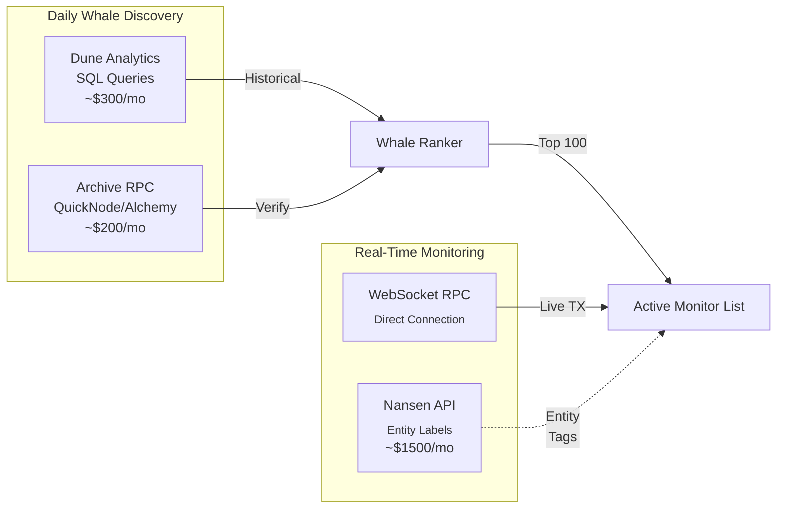
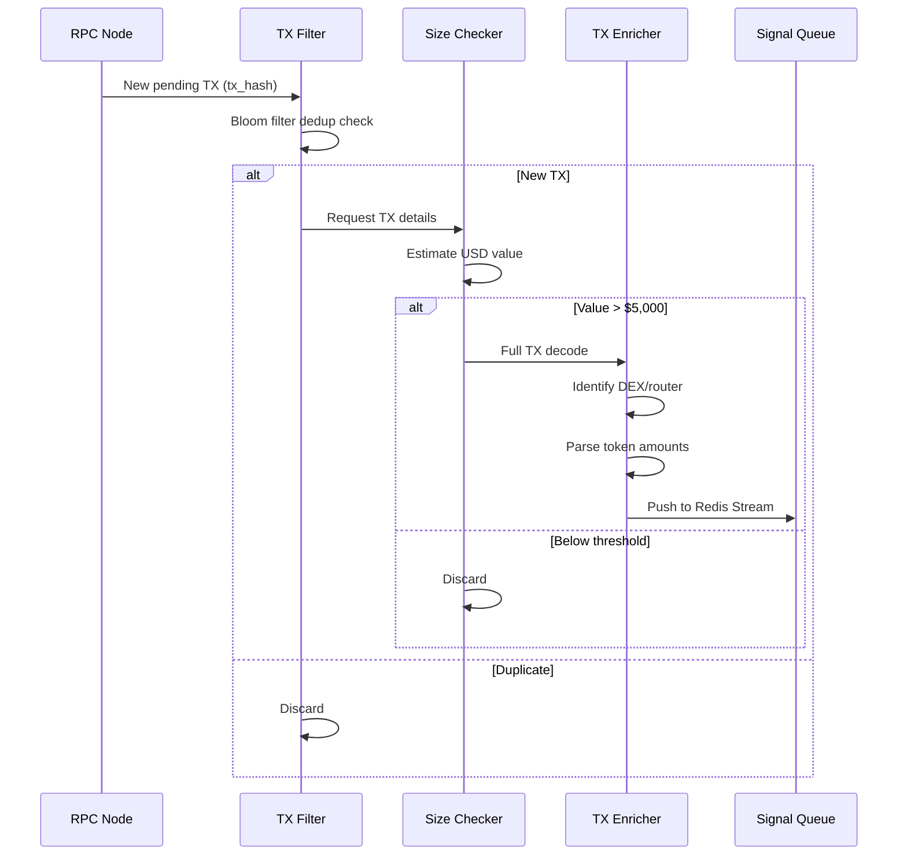

# Whale Tracker: Real-Time Copy-Trading System

## Executive Summary

A high-frequency, low-latency whale tracking and copy-trading system designed to detect and replicate profitable wallet transactions within **8-15 seconds** of execution. The system prioritizes speed, risk management, and automation.

**Target Latency:** Whale trade detection → Our execution: **8-15 seconds**

---

## Architecture Overview



---

## 1. Wallet Identification System

### 1.1 Historical Performance Scanner

```python
# whale_discovery.py
from dataclasses import dataclass
from typing import List, Optional
import numpy as np

@dataclass
class WhaleProfile:
    address: str
    roi_90d: float
    sharpe_ratio: float
    win_rate: float
    avg_trade_size: float
    max_drawdown: float
    trades_count: int
    last_active: int  # unix timestamp
    tier: str  # 'alpha', 'beta', 'watch'

class WhaleDiscoveryEngine:
    """
    Scans historical on-chain data to identify high-performing wallets.
    Runs daily via Dune Analytics + direct RPC archive nodes.
    """
    
    MIN_ROI = 1.0  # 100% ROI
    MIN_SHARPE = 2.0
    MIN_WIN_RATE = 0.55
    MAX_DRAWDOWN = 0.30  # 30%
    MIN_TRADES = 20
    ACTIVITY_THRESHOLD_DAYS = 7
    
    async def scan_whales(self, chain: str = "ethereum") -> List[WhaleProfile]:
        """
        Pipeline:
        1. Query Dune for wallets with >$100K volume (90d)
        2. Calculate ROI, Sharpe, win rate per wallet
        3. Filter by performance thresholds
        4. Verify recent activity via RPC
        5. Assign tier and confidence score
        """
        candidates = await self._query_dune_candidates(chain)
        
        whales = []
        for wallet in candidates:
            metrics = await self._calculate_metrics(wallet)
            
            if self._passes_filters(metrics):
                profile = WhaleProfile(
                    address=wallet,
                    roi_90d=metrics['roi'],
                    sharpe_ratio=metrics['sharpe'],
                    win_rate=metrics['win_rate'],
                    avg_trade_size=metrics['avg_size'],
                    max_drawdown=metrics['max_dd'],
                    trades_count=metrics['trade_count'],
                    last_active=metrics['last_tx'],
                    tier=self._assign_tier(metrics)
                )
                whales.append(profile)
        
        return sorted(whales, key=lambda w: w.sharpe_ratio, reverse=True)
    
    def _passes_filters(self, m: dict) -> bool:
        return (
            m['roi'] >= self.MIN_ROI and
            m['sharpe'] >= self.MIN_SHARPE and
            m['win_rate'] >= self.MIN_WIN_RATE and
            m['max_dd'] <= self.MAX_DRAWDOWN and
            m['trade_count'] >= self.MIN_TRADES
        )
```

### 1.2 Performance Metrics Calculation

| Metric | Formula | Target |
|--------|---------|--------|
| **ROI** | `(Final - Initial) / Initial` | >100% (90d) |
| **Sharpe** | `(Return - RiskFree) / StdDev(Returns)` | >2.0 |
| **Win Rate** | `Winning Trades / Total Trades` | >55% |
| **Max Drawdown** | `Peak - Trough / Peak` | <30% |
| **Calmar** | `Annual Return / Max Drawdown` | >3.0 |

### 1.3 Data Provider Strategy



---

## 2. Real-Time Monitoring Infrastructure

### 2.1 WebSocket vs Polling Latency Comparison

| Method | Latency | CPU Load | Reliability | Use Case |
|--------|---------|----------|-------------|----------|
| **WebSocket** | 50-200ms | Low | Medium-High | Primary feed |
| **HTTP Polling** | 500-2000ms | High | High | Fallback |
| **Mempool Stream** | 10-100ms | Medium | Medium | Pre-chain detection |
| **Block Listener** | 1-12s | Low | Very High | Confirmation |

### 2.2 Multi-Node Stream Architecture

```python
# stream_aggregator.py
import asyncio
from typing import Dict, Set
import websockets
import json

class MultiNodeStreamAggregator:
    """
    Aggregates transaction streams from multiple RPC providers
    for redundancy and lower latency via race conditions.
    """
    
    NODE_ENDPOINTS = {
        'alchemy': 'wss://eth-mainnet.g.alchemy.com/v2/{key}',
        'quicknode': 'wss://winter-lively-general.quiknode.pro/{key}',
        'chainstack': 'wss://ws-nd-xxx.p2pify.com/{key}',
        'self_hosted': 'wss://rpc.internal.local:8546'
    }
    
    WATCHED_WALLETS: Set[str] = set()  # Populated from WhaleDiscovery
    
    def __init__(self):
        self.seen_txs = BloomFilter(capacity=100000, error_rate=0.001)
        self.redis = Redis(host='localhost', port=6379, db=0)
        
    async def start_monitoring(self):
        """Start WebSocket connections to all nodes."""
        tasks = [
            self._node_stream(node, endpoint)
            for node, endpoint in self.NODE_ENDPOINTS.items()
        ]
        await asyncio.gather(*tasks)
    
    async def _node_stream(self, node_name: str, endpoint: str):
        """Maintain persistent WebSocket connection with auto-reconnect."""
        while True:
            try:
                async with websockets.connect(endpoint, ping_interval=30) as ws:
                    # Subscribe to pending transactions
                    await ws.send(json.dumps({
                        "jsonrpc": "2.0",
                        "id": 1,
                        "method": "eth_subscribe",
                        "params": ["pendingTransactions"]
                    }))
                    
                    async for message in ws:
                        await self._process_message(node_name, message)
                        
            except Exception as e:
                logger.error(f"{node_name} stream error: {e}")
                await asyncio.sleep(5)  # Reconnect delay
    
    async def _process_message(self, source: str, message: str):
        """Process incoming transaction with deduplication."""
        data = json.loads(message)
        tx_hash = data.get('params', {}).get('result')
        
        if not tx_hash or tx_hash in self.seen_txs:
            return
        
        self.seen_txs.add(tx_hash)
        
        # Publish to Redis Stream for processing
        await self.redis.xadd(
            'pending_transactions',
            {'tx_hash': tx_hash, 'source': source, 'ts': time.time()}
        )
```

### 2.3 Transaction Filtering Pipeline



---

## 3. Signal Processing Engine

### 3.1 Trade Direction Analysis

```python
# signal_processor.py
from enum import Enum
from dataclasses import dataclass
import web3

class TradeDirection(Enum):
    BUY = "buy"
    SELL = "sell"
    UNKNOWN = "unknown"

@dataclass
class TradeSignal:
    whale_address: str
    tx_hash: str
    token_in: str
    token_out: str
    amount_in: float
    amount_out: float
    direction: TradeDirection
    confidence: float
    expected_impact: float
    timestamp: float

class SignalProcessor:
    """
    Analyzes decoded transactions to determine:
    - Trade direction (BUY/SELL)
    - Market impact estimation
    - Confidence scoring
    - False positive filtering
    """
    
    DEX_ROUTERS = {
        '0x7a250d5630B4cF539739dF2C5dAcb4c659F2488D': 'UniswapV2',
        '0xE592427A0AEce92De3Edee1F18E0157C05861564': 'UniswapV3',
        '0x68b3465833fb72A70ecDF485E0e4C7bD8665Fc45': 'UniswapV3Router2',
        '0x1111111254eeb25477b68fb85ed929f73a960582': '1inch'
    }
    
    STABLECOINS = {'USDC', 'USDT', 'DAI', 'BUSD'}
    
    async def process_signal(self, tx_data: dict) -> Optional[TradeSignal]:
        """
        Decode transaction and generate trade signal.
        """
        # Parse transaction details
        router = tx_data['to']
        decoded = self._decode_input(tx_data['input'])
        
        if not decoded:
            return None
        
        # Determine direction based on token flow
        direction = self._classify_direction(decoded)
        
        # Estimate market impact
        impact = await self._estimate_impact(
            token=decoded['token_out'],
            amount=decoded['amount_out']
        )
        
        # Calculate confidence score
        confidence = await self._score_confidence(
            whale=tx_data['from'],
            direction=direction,
            impact=impact
        )
        
        # Filter false positives
        if await self._is_false_positive(tx_data, decoded):
            return None
        
        return TradeSignal(
            whale_address=tx_data['from'],
            tx_hash=tx_data['hash'],
            token_in=decoded['token_in'],
            token_out=decoded['token_out'],
            amount_in=decoded['amount_in'],
            amount_out=decoded['amount_out'],
            direction=direction,
            confidence=confidence,
            expected_impact=impact,
            timestamp=time.time()
        )
    
    def _classify_direction(self, decoded: dict) -> TradeDirection:
        """
        Classify as BUY or SELL based on token flow.
        BUY: Stablecoin → Token
        SELL: Token → Stablecoin
        """
        token_in_symbol = self._get_token_symbol(decoded['token_in'])
        token_out_symbol = self._get_token_symbol(decoded['token_out'])
        
        if token_in_symbol in self.STABLECOINS:
            return TradeDirection.BUY
        elif token_out_symbol in self.STABLECOINS:
            return TradeDirection.SELL
        else:
            return TradeDirection.UNKNOWN
    
    async def _is_false_positive(self, tx_data: dict, decoded: dict) -> bool:
        """
        Filter out:
        - Test trades (< $100)
        - Hedging positions (simultaneous buy/sell)
        - Dust transactions
        - Known MEV bot patterns
        """
        # Check against MEV bot database
        if await self._is_mev_pattern(tx_data):
            return True
        
        # Check for simultaneous opposite trades (hedging)
        if await self._is_hedging(tx_data['from']):
            return True
        
        return False
```

### 3.2 Confidence Scoring Algorithm

```python
async def calculate_confidence(
    whale_address: str,
    direction: TradeDirection,
    token: str,
    amount: float
) -> float:
    """
    Multi-factor confidence score (0.0 - 1.0)
    """
    whale = await get_whale_profile(whale_address)
    
    factors = {
        # Historical performance weight: 40%
        'historical_roi': min(whale.roi_90d / 2, 1.0) * 0.20,
        'win_rate': whale.win_rate * 0.20,
        
        # Consistency weight: 25%
        'sharpe': min(whale.sharpe_ratio / 3, 1.0) * 0.15,
        'drawdown': (1 - whale.max_drawdown) * 0.10,
        
        # Current context: 20%
        'token_familiarity': await token_history_score(whale, token) * 0.10,
        'size_consistency': size_match_score(whale, amount) * 0.10,
        
        # Market conditions: 15%
        'market_regime': await market_condition_score() * 0.10,
        'liquidity': await liquidity_score(token, amount) * 0.05
    }
    
    confidence = sum(factors.values())
    return min(max(confidence, 0.0), 1.0)
```

---

## 4. Copy Execution System

### 4.1 Smart Wallet vs EOA Analysis

| Feature | EOA (Externally Owned Account) | Smart Wallet (ERC-4337) |
|---------|-------------------------------|------------------------|
| **Gas Efficiency** | Standard | ~15-30% higher (entry point) |
| **Batching** | ❌ No | ✅ Yes (multi-tx in one) |
| **Automation** | ❌ Requires hot key | ✅ Session keys, scheduled |
| **Recovery** | ❌ Seed phrase only | ✅ Social recovery |
| **Cancellation** | ❌ Manual nonce | ✅ Time-bound, revocable |
| **Latency** | ~12s (1 block) | ~12s + bundler delay |

**Recommendation:** Use ERC-4337 Smart Wallet with session keys for automation.

### 4.2 Execution Engine

```python
# execution_engine.py
from eth_account import Account
from web3 import Web3
import asyncio

class CopyTradingExecutor:
    """
    Executes copy trades with:
    - Dynamic position sizing
    - Slippage protection
    - Execution delays (avoid front-running)
    - Partial fill handling
    """
    
    def __init__(self):
        self.w3 = Web3(Web3.HTTPProvider(os.getenv('RPC_URL')))
        self.smart_wallet = SmartWallet(os.getenv('WALLET_ADDRESS'))
        self.daily_trade_count = 0
        self.daily_reset_time = time.time()
        self.active_positions = {}
        
    async def execute_copy_trade(self, signal: TradeSignal):
        """
        Execute copy trade with full risk controls.
        """
        # Check daily limits
        if not await self._check_daily_limits():
            logger.warning("Daily trade limit reached")
            return
        
        # Check correlation (avoid same market)
        if await self._is_correlated_position(signal.token_out):
            logger.info(f"Skipping correlated token: {signal.token_out}")
            return
        
        # Calculate position size
        size = self._calculate_position_size(signal)
        if size <= 0:
            return
        
        # Apply execution delay
        delay = self._calculate_delay(signal)
        await asyncio.sleep(delay)
        
        # Get fresh quote (slippage protection)
        quote = await self._get_quote(
            token_in=signal.token_in,
            token_out=signal.token_out,
            amount=size,
            max_slippage=0.005  # 0.5%
        )
        
        if not quote:
            logger.warning("Quote failed - skipping trade")
            return
        
        # Verify slippage vs whale entry
        if self._slippage_exceeded(signal, quote):
            logger.warning("Slippage exceeds threshold")
            return
        
        # Execute trade
        tx_hash = await self._submit_trade(quote)
        
        # Track position
        self._record_position(signal, tx_hash, size)
        self.daily_trade_count += 1
    
    def _calculate_position_size(self, signal: TradeSignal) -> float:
        """
        Position sizing: 0.1x to 0.5x of whale size
        Based on confidence score and whale tier.
        """
        multiplier_map = {
            'alpha': 0.5,
            'beta': 0.3,
            'watch': 0.1
        }
        
        base_multiplier = multiplier_map.get(signal.whale_tier, 0.1)
        confidence_adjustment = signal.confidence  # 0.0 - 1.0
        
        multiplier = base_multiplier * confidence_adjustment
        multiplier = max(0.1, min(0.5, multiplier))
        
        size = signal.amount_in * multiplier
        
        # Apply max exposure cap
        max_exposure = 2000  # $2,000
        return min(size, max_exposure)
    
    def _calculate_delay(self, signal: TradeSignal) -> int:
        """
        Execution delay: 5-30 seconds
        Higher confidence = shorter delay
        Lower confidence = longer delay (avoid front-running)
        """
        base_delay = 5
        confidence_factor = (1 - signal.confidence) * 25
        return int(base_delay + confidence_factor)
    
    async def _check_daily_limits(self) -> bool:
        """Max 10 copy trades per day."""
        if time.time() - self.daily_reset_time > 86400:
            self.daily_trade_count = 0
            self.daily_reset_time = time.time()
        
        return self.daily_trade_count < 10
```

### 4.3 Slippage Estimation Model

```python
class SlippageEstimator:
    """
    Estimates expected slippage based on:
    - Pool liquidity depth
    - Trade size relative to pool
    - Recent volatility
    - DEX route complexity
    """
    
    async def estimate_slippage(
        self,
        token_in: str,
        token_out: str,
        amount: float,
        dex: str = 'uniswap_v3'
    ) -> float:
        """
        Returns expected slippage as decimal (e.g., 0.005 = 0.5%)
        """
        # Get pool liquidity
        liquidity = await self._get_pool_liquidity(token_in, token_out, dex)
        
        # Calculate impact ratio
        impact_ratio = amount / liquidity['tvl_usd']
        
        # Base slippage formula
        base_slippage = impact_ratio * 0.5
        
        # Adjust for volatility
        volatility_factor = await self._get_volatility_factor(token_out)
        
        # Adjust for route hops
        hop_penalty = (liquidity['hops'] - 1) * 0.001
        
        estimated = base_slippage * volatility_factor + hop_penalty
        
        return min(estimated, 0.05)  # Cap at 5%
```

---

## 5. Risk Control System

### 5.1 Risk Management Rules

```python
class RiskManager:
    """
    Comprehensive risk controls for copy trading.
    """
    
    # Daily limits
    MAX_DAILY_TRADES = 10
    MAX_DAILY_EXPOSURE = 10000  # $10,000
    
    # Per-whale limits
    MAX_EXPOSURE_PER_WHALE = 2000  # $2,000
    MAX_CONCURRENT_WHALES = 5
    
    # Auto-blacklist rules
    CONSECUTIVE_LOSSES_THRESHOLD = 3
    MIN_TRADES_BEFORE_EVAL = 5
    
    async def evaluate_trade(self, signal: TradeSignal) -> RiskDecision:
        """
        Multi-layer risk evaluation.
        """
        checks = [
            self._check_daily_limits(),
            self._check_whale_exposure(signal.whale_address),
            self._check_correlation(signal.token_out),
            self._check_whale_health(signal.whale_address),
            self._check_market_conditions(),
        ]
        
        results = await asyncio.gather(*checks)
        
        if not all(results):
            return RiskDecision.REJECT
        
        return RiskDecision.APPROVE
    
    async def _check_whale_health(self, whale_address: str) -> bool:
        """
        Check if whale should be blacklisted due to poor performance.
        """
        recent_trades = await self._get_recent_trades(whale_address, limit=10)
        
        if len(recent_trades) < self.MIN_TRADES_BEFORE_EVAL:
            return True
        
        consecutive_losses = 0
        for trade in reversed(recent_trades):
            if trade.pnl < 0:
                consecutive_losses += 1
                if consecutive_losses >= self.CONSECUTIVE_LOSSES_THRESHOLD:
                    await self._blacklist_whale(whale_address)
                    return False
            else:
                break
        
        return True
    
    async def _check_correlation(self, token: str) -> bool:
        """
        Prevent copying multiple whales on the same market.
        """
        active_tokens = [pos.token for pos in self.active_positions.values()]
        
        # Check direct correlation
        if token in active_tokens:
            return False
        
        # Check sector correlation (e.g., don't trade 2 DeFi tokens)
        token_sector = await self._get_token_sector(token)
        active_sectors = [await self._get_token_sector(t) for t in active_tokens]
        
        if active_sectors.count(token_sector) >= 2:
            return False
        
        return True
```

---

## 6. Provider Recommendations

### 6.1 Recommended Stack

| Component | Provider | Cost/Month | Latency | Rationale |
|-----------|----------|------------|---------|-----------|
| **Primary RPC** | QuickNode WS | $200 | 50-150ms | Fastest WebSocket, global edge |
| **Backup RPC** | Alchemy | $200 | 100-200ms | Reliability, archive data |
| **Entity Intel** | Nansen | $1,500 | API: 200ms | Best whale labeling, smart money |
| **Historical** | Dune | $300 | Async | Custom queries, backtesting |
| **Alternative** | Arkham | Free-$500 | API: 300ms | Exchange/wallet entity mapping |
| **Execution** | Pimlico | Pay-per-op | ~2s | ERC-4337 bundler |

### 6.2 API Rate Limits & Optimization

```yaml
# Rate limit configuration
providers:
  alchemy:
    ws_connections: 1
    requests_per_second: 300
    batch_size: 100
    
  quicknode:
    ws_connections: 2
    requests_per_second: 600
    batch_size: 50
    
  nansen:
    requests_per_minute: 100
    burst: 20
    cache_ttl: 300  # 5 minutes
    
  dune:
    async_only: true
    query_frequency: hourly
    
# Optimization strategies
optimizations:
  - Multicall for token balances
  - Redis caching for entity lookups
  - Batch RPC requests when possible
  - Local mempool monitoring where feasible
```

---

## 7. Latency Breakdown

### 7.1 End-to-End Timing

```mermaid
gantt
    title Whale Trade → Our Execution Timeline
    dateFormat X
    axisFormat %s
    
    section Whale Transaction
    Whale submits TX           :w1, 0, 500ms
    TX propagates mempool      :w2, after w1, 300ms
    
    section Detection
    WebSocket receive          :d1, after w2, 50ms
    Bloom filter check         :d2, after d1, 5ms
    Size validation            :d3, after d2, 100ms
    
    section Analysis
    TX decode & enrich         :a1, after d3, 200ms
    Direction analysis         :a2, after a1, 50ms
    Confidence scoring         :a3, after a2, 300ms
    Risk validation            :a4, after a3, 200ms
    
    section Execution
    Position sizing            :e1, after a4, 50ms
    Quote fetch                :e2, after e1, 500ms
    Slippage check             :e3, after e2, 50ms
    Execution delay            :e4, after e3, 5000ms
    Submit transaction         :e5, after e4, 200ms
    
    section Blockchain
    TX confirmation            :b1, after e5, 12000ms
```



### 7.2 Target Latencies

| Stage | Target | Max Acceptable |
|-------|--------|----------------|
| Mempool detection | 50-200ms | 500ms |
| Transaction filtering | 100ms | 200ms |
| Signal analysis | 500ms | 1,500ms |
| Quote + slippage | 500ms | 1,000ms |
| Execution delay | 5,000ms | 30,000ms |
| TX submission | 200ms | 500ms |
| **Total (before delay)** | **~2s** | **4s** |
| **Total (with delay)** | **~7s** | **35s** |

---

## 8. Infrastructure Requirements

### 8.1 Hardware Specs

```yaml
production:
  stream_processor:
    cpu: 4 cores
    ram: 8 GB
    network: 1 Gbps
    region: aws-us-east-1 (closest to Ethereum nodes)
    
  execution_node:
    cpu: 2 cores
    ram: 4 GB
    storage: SSD for local cache
    
  database:
    type: Redis Cluster + PostgreSQL
    ram: 16 GB
    storage: 500 GB SSD
    replication: 2x
```

### 8.2 Monitoring Stack

```yaml
monitoring:
  metrics: Prometheus + Grafana
  logs: Loki
  alerts: PagerDuty
  
  key_metrics:
    - detection_latency_ms
    - execution_latency_ms
    - copy_trade_pnl
    - slippage_actual_vs_estimated
    - ws_connection_uptime
    - api_rate_limit_hits
    - daily_trade_count
    - whale_blacklist_count
```

---

## 9. Implementation Roadmap

### Phase 1: MVP (Week 1-2)
- [ ] WebSocket connection to single RPC
- [ ] Basic whale monitoring (manual list)
- [ ] Simple BUY/SELL detection
- [ ] Manual execution with alerts

### Phase 2: Automation (Week 3-4)
- [ ] Multi-RPC aggregation
- [ ] Automated position sizing
- [ ] Smart wallet integration
- [ ] Basic risk controls

### Phase 3: Intelligence (Week 5-6)
- [ ] Whale discovery engine
- [ ] Confidence scoring
- [ ] Slippage estimation
- [ ] Correlation detection

### Phase 4: Production (Week 7-8)
- [ ] Full risk management
- [ ] Monitoring & alerting
- [ ] Performance optimization
- [ ] Security hardening

---

## 10. Cost Estimates

### Monthly Operating Costs

| Component | Cost |
|-----------|------|
| RPC Nodes (2x) | $400 |
| Nansen API | $1,500 |
| Dune Analytics | $300 |
| Infrastructure (AWS) | $500 |
| Bundler (Pimlico) | ~$100 |
| **Total** | **~$2,800/mo** |

### Potential Returns (Hypothetical)

| Scenario | Avg Trade | Daily Trades | Monthly Volume | Return | Monthly PnL |
|----------|-----------|--------------|----------------|--------|-------------|
| Conservative | $500 | 5 | $75K | 2% | $1,500 |
| Moderate | $1,000 | 8 | $240K | 3% | $7,200 |
| Aggressive | $1,500 | 10 | $450K | 5% | $22,500 |

---

## 11. Security Considerations

1. **Private Key Management**: Use AWS KMS or HashiCorp Vault
2. **Session Keys**: Time-bounded, limited scope
3. **Rate Limiting**: Prevent API exhaustion attacks
4. **Whale Verification**: Cross-reference multiple sources
5. **Circuit Breaker**: Auto-pause on consecutive losses
6. **Access Control**: Multi-sig for parameter changes

---

## Appendix A: Database Schema

```sql
-- Whales table
CREATE TABLE whales (
    address VARCHAR(42) PRIMARY KEY,
    roi_90d DECIMAL(10,4),
    sharpe_ratio DECIMAL(10,4),
    win_rate DECIMAL(5,4),
    avg_trade_size DECIMAL(20,8),
    max_drawdown DECIMAL(5,4),
    tier VARCHAR(10),
    is_active BOOLEAN DEFAULT true,
    created_at TIMESTAMP DEFAULT NOW()
);

-- Trades table
CREATE TABLE copy_trades (
    id SERIAL PRIMARY KEY,
    whale_address VARCHAR(42) REFERENCES whales(address),
    tx_hash VARCHAR(66),
    token_in VARCHAR(42),
    token_out VARCHAR(42),
    amount_in DECIMAL(30,18),
    amount_out DECIMAL(30,18),
    direction VARCHAR(4),
    confidence DECIMAL(3,2),
    pnl DECIMAL(20,8),
    executed_at TIMESTAMP
);

-- Indices
CREATE INDEX idx_trades_whale ON copy_trades(whale_address);
CREATE INDEX idx_trades_time ON copy_trades(executed_at);
```

---

*Document Version: 1.0*  
*Last Updated: 2025-01-10*  
*Target Chain: Ethereum Mainnet (expandable to L2s)*
